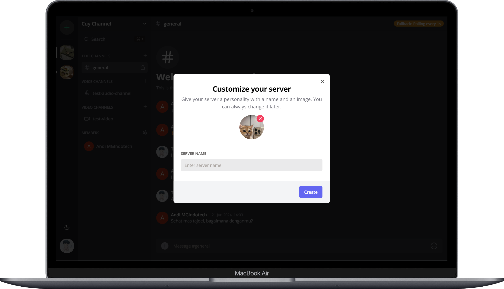
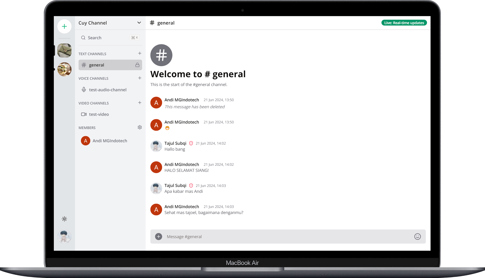

# Vingzcord

## Project Description

Vingzcord is an innovative application that offers a communication experience similar to Discord. With Vingzcord, users can add channels for organized discussions, invite members to join, and enjoy advanced communication features such as live video, voice calls, and real-time chat using Socket.IO.

## Tech Stack

- Next JS
- Typescript
- TailwindCSS
- Shadcn UI
- Tanstack Query
- Zustand
- React Hook Form
- Clerk Auth
- Zod
- Prisma
- Mongodb
- Socket.IO
- LiveKit
- Uploadthing

## Demo

You can see a demo of this project at [https://vingzcord.vercel.app](https://vingzcord.vercel.app).

## Screenshots

<table>
  <tr>
    <td></td>
    <td></td>
  </tr>
  <tr>
    <td></td>
    <td></td>
  </tr>
  <tr>
    <td></td>
    <td></td>
  </tr>
  <tr>
    <td></td>
    <td></td>
  </tr>

   <tr>
    <td></td>
    <td></td>
  </tr>
   <tr>
    <td></td>
    <td></td>
  </tr>
</table>

## Feedback

If you have any feedback, please reach out to us at [subqitajul7@gmail.com](mailto:subqitajul7@gmail.com)

## Authors

- [Tajul Subqi](https://github.com/tajulsubqi)
